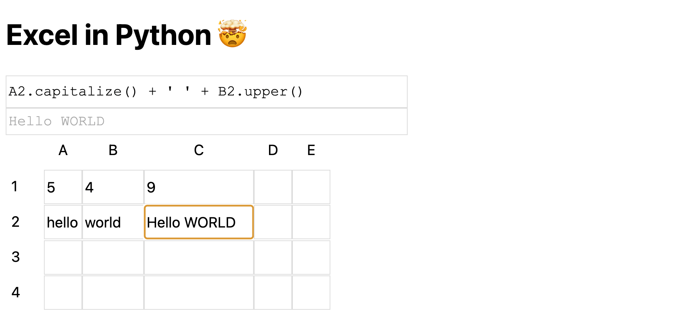

# Excel in Python

This is a spreadsheet, implemented in Python, completely running in the browser, using PyScript.

Microsoft recently released Python-in-Excel, allowing the use of Python inside Excel spreadsheets. 

In this project, we do the opposite and implement the dependency graph used by spreadsheets like Excel, 
but write everyyhing in Python. This project uses PyScript to display its UI using Python in a browser.  It contains no JavaScript at all.

This example includes two cell functions:
- C1: `A1+B1`, this adds two numbers
- C2: `A2.capitalize() + ' ' + B2.upper()`, this concatenates two strings

# Notes

- This project is not associated with Microsoft Corporation. 
- Excel is a registered trademark of Microsoft Corporation.
